# frida-smali-trace

通过frida hook追踪所有smali指令执行情况

在Pixel4 Android 11下运行【64位】APP进行测试，版本号`RQ3A.210805.001.A1`

效果示意

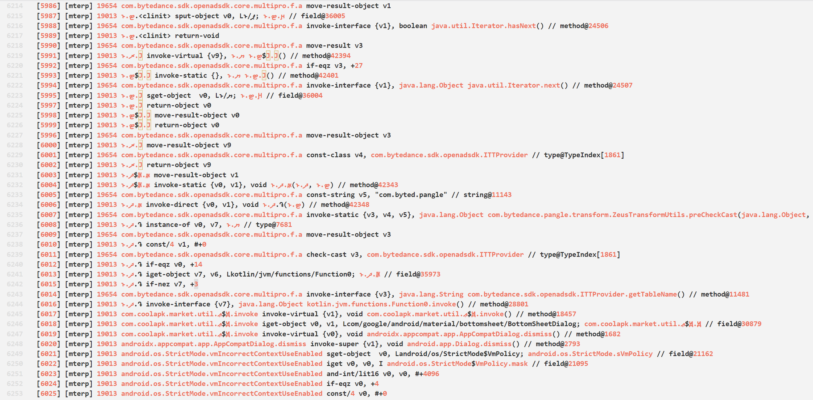

实现过程

- [纯frida实现smali追踪](https://blog.seeflower.dev/archives/84/)

# 使用

## 命令示意

```bash
frida -U -n LibChecker -l _agent.js -o trace.log
```

如果使用frida 15之前的版本，`-n`后面是包名

```bash
frida -U -n com.absinthe.libchecker -l _agent.js -o trace.log
```

## 准备工作

安装库，并进行编译测试

```
cd frida_scripts
npm install
npm run watch
```

如果只是简单使用，那么后面都不用管

---

在正式使用此脚本之前，需要先找到关键位置，以及几个关键寄存器

从手机中提取libart.so

```bash
adb pull /apex/com.android.art/lib64/libart.so
```

用IDA打开libart.so，让IDA反汇编

将`index.ts`中的`hook_mterp`改为`false`

在`trace_interpreter_enrty`的`ExecuteSwitchImplCpp`日志打印中添加`${offset}`

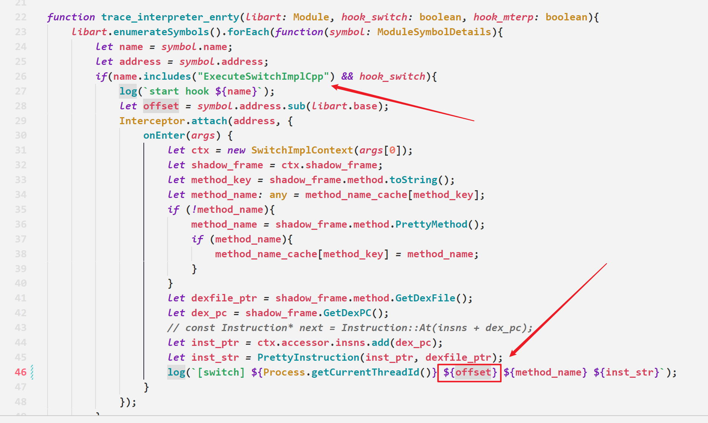

开启frida-server，运行命令注入脚本，具体APP请自行选择

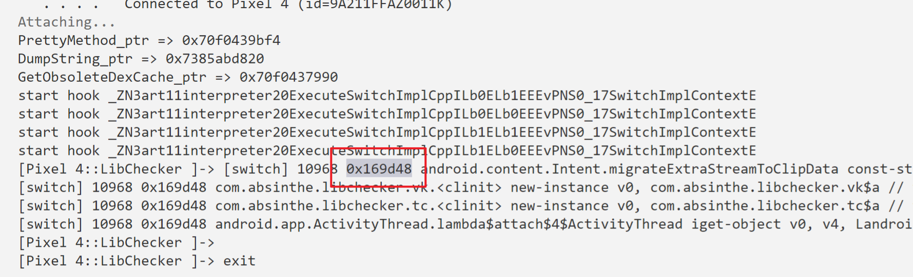

随便滑动、点击下APP，脚本会给出一个偏移位置，比如我这里是`0x169d48`

IDA中按`G`，`粘贴`地址，`回车`跳转，就会进入到其中一个`ExecuteSwitchImplCpp`实现

按`F5`查看伪代码

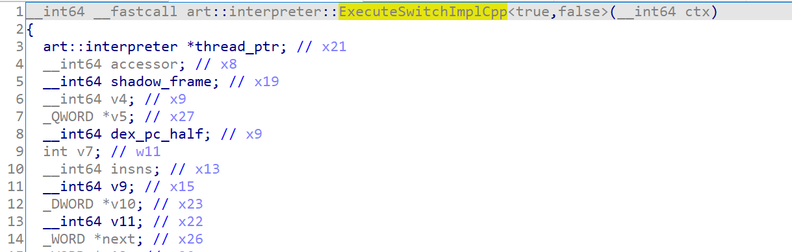

往下翻，找到第一个while处，按`TAB`键跳转到汇编窗口

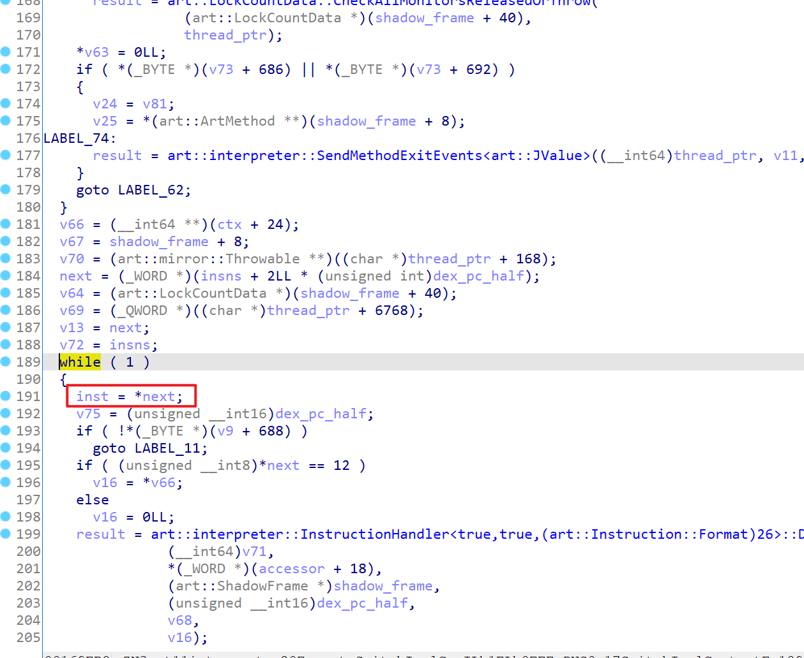

然后检查特征，关键特征是和`0xFF`相与，以及`BR`指令


特征确定后，那么记录下此处的偏移，比如我这里是`0x169EB4`

和`0xFF`相与的是`opcode`，而`opcode`是从`inst(Instruction)`取的

根据这个规则，可以推测图中`X28`是`opcode`，`X26`是`inst`

现在回调函数开头，将`a1`命名为`ctx`，其偏移`16`也就是两个指针大小（64位下就是2 * 8 = 16）的取值就是`shadow_frame`，那么对应寄存器在后续也是`shadow_frame`，我这里是`x19`

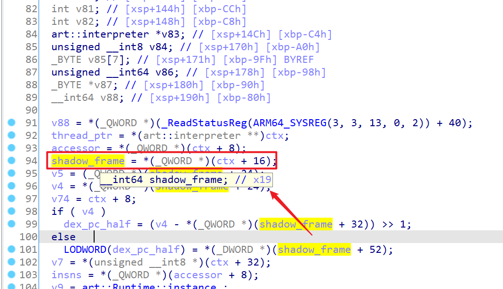

现在将`index.ts`中的`trace_interpreter_switch`注释取消掉，把上面分析得到的`0x169EB4`、`x19`、`x26`对应修改

```JavaScript
// 参数二是 while 循环中 inst 赋值给 next 的偏移
// 参数三是存 shadow_frame 的寄存器
// 参数四是存 inst(Instruction) 的寄存器
trace_interpreter_switch(libart, 0x169EB4, 'x19', 'x26');
```

然后将`hook_switch`和`hook_mterp`改为`false`，编译新的js，进行测试

如果没有问题，现在IDA搜索`ExecuteMterpImpl`，跳转到对应函数，按F5查看伪代码，应该长这样

第一个参数是`thread`

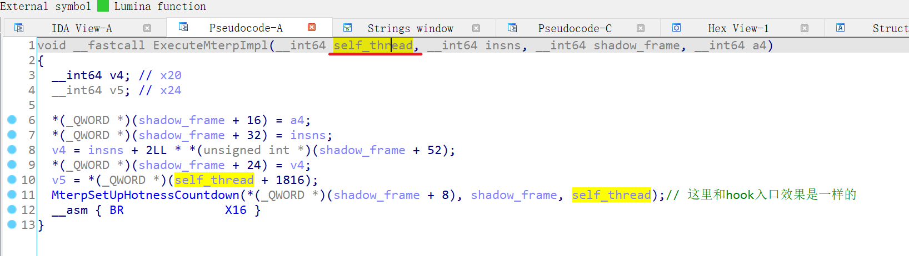

按`TAB`查看汇编代码，看看`x0`给哪个寄存器了，我这里是`x22`，记录下来，那么`x22`就是`thread`

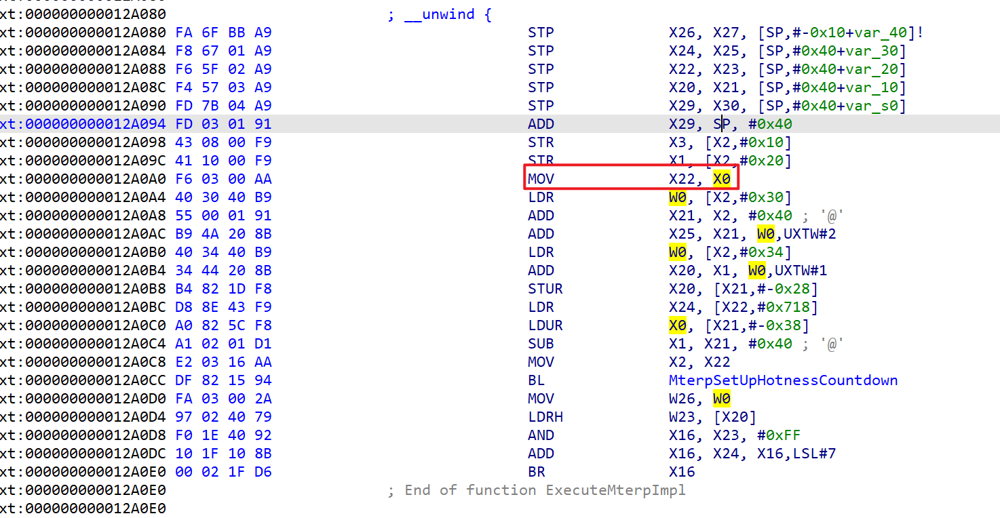

然后直接在汇编窗口往下翻，找一个符号是`mterp_op_`开头的代码（除了`mterp_op_nop`）

然后找一个和`0xFF`相与的寄存器，再往几行前看下是哪个寄存器读取来的，比如我这和`0xFF`相与的是`x23`，`x23`是由`x20`读取来的，那么`x20`就是`inst`

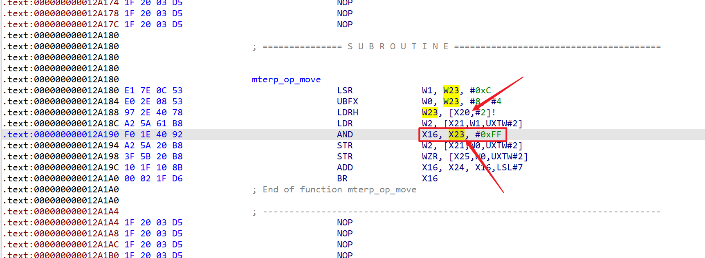

现在将`index.ts`中的`trace_interpreter_mterp_op`注释取消掉，把上面分析得到的`x22`、`x20`对应修改

```JavaScript
// 参数二是存 thread 的寄存器
// 参数三是存 inst(Instruction) 的寄存器
trace_interpreter_mterp_op(libart, "x22", "x20");
```

编译新的js，进行测试

如果顺利，那么现在能够trace 64位APP的smali执行详情了

如果检查找后面的参数太麻烦，也可以注释掉`trace_interpreter_switch`和`trace_interpreter_mterp_op`

将`hook_switch`和`hook_mterp`改为`true`，这样只会做简单的trace

---

如果通过静态分析的方法无法确定寄存器，可以自行修改脚本，打印全部寄存器情况

比如要检查`switch`在`while`处的`shadow_frame`是哪个寄存器，修改代码如下

```JavaScript
// main
let hook_switch = true;
let hook_mterp = false;
trace_interpreter_enrty(libart, hook_switch, hook_mterp);
// trace_interpreter_enrty ExecuteSwitchImplCpp 日志添加一个 ${shadow_frame}
log(`[switch] ${Process.getCurrentThreadId()} ${shadow_frame} ${offset} ${method_name} ${inst_str}`);
// trace_interpreter_switch
log(`[${id}] [switch] ${JSON.stringify(ctx)}`);
```

`trace_interpreter_switch`只打印寄存器信息日志

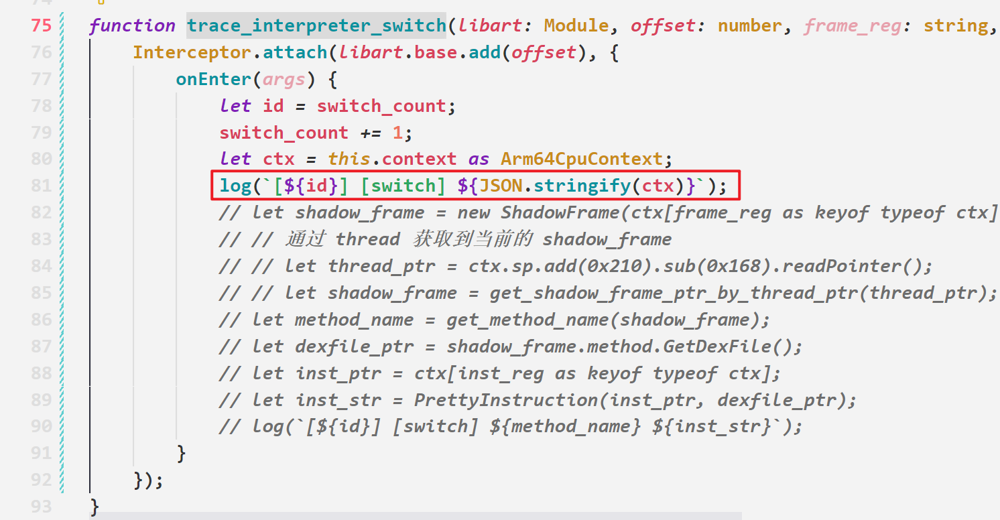

这样也能定位出`shadow_frame`存在哪个寄存器，确定后再修改`trace_interpreter_switch`具体参数，还原代码

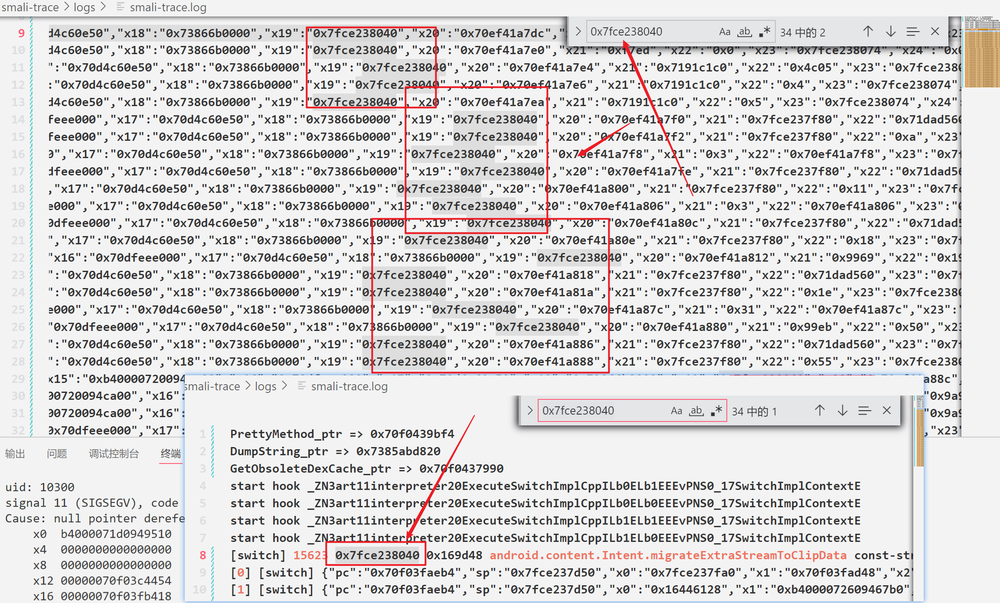

类似的，将关键代码修改如下，测试查看`thread`是在哪个寄存器

```JavaScript
// main
let hook_switch = false;
let hook_mterp = true;
trace_interpreter_enrty(libart, hook_switch, hook_mterp);
// trace_interpreter_enrty ExecuteMterpImpl 日志添加一个 ${args[0]}
log(`[mterp] ${Process.getCurrentThreadId()} ${args[0]} ${method_name} ${inst_str}`);
// trace_interpreter_mterp_op 只打印一个指令的 避免过多输出
if (symbol.name != "mterp_op_move") continue;
// hook_mterp_op
log(`[${id}] [mterp] ${JSON.stringify(ctx)}`);
```

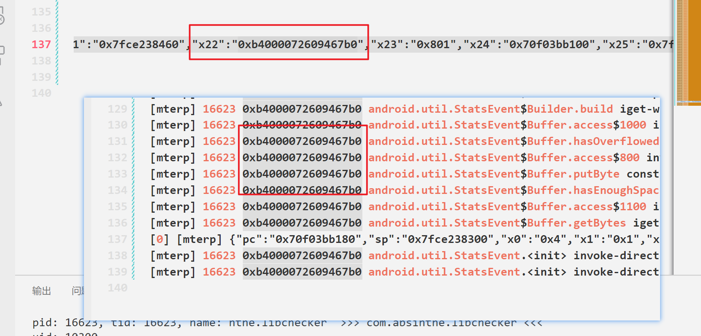

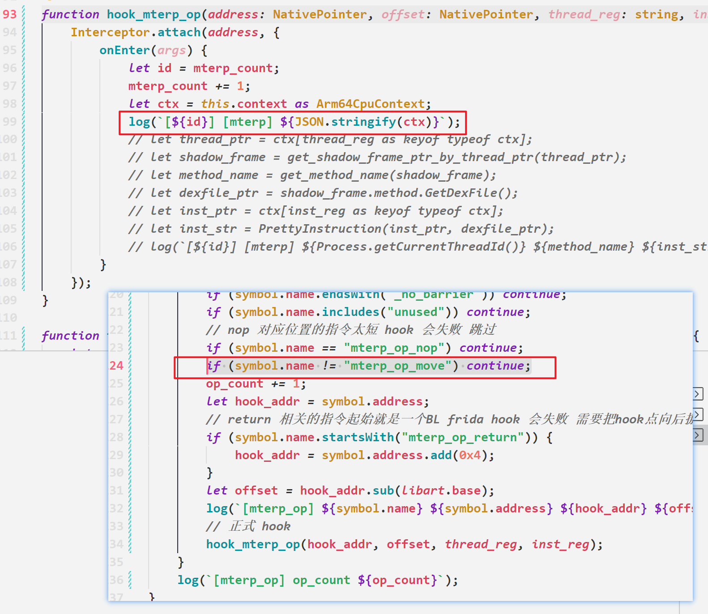

---

注意，由于hook指令详细情况的位置里入口可能太近，除了上面的测试过程，其他时候

- 使用了 trace_interpreter_switch 则 hook_switch 应当为 false
- 使用了 trace_interpreter_mterp_op 则 hook_mterp 应当为 false

如果感兴趣详细实现过程，请查看[纯frida实现smali追踪](./纯frida实现smali追踪.md)